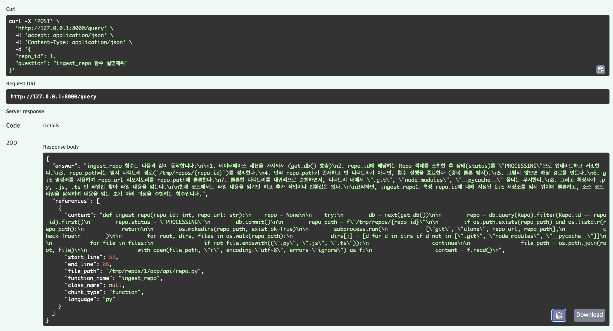

# 🚀 CodeScope AI

> 코드베이스를 함수 단위로 분석하고, 근거 기반으로 설명하는 AI 시스템

---

## 📌 Demo

### 💬 질문
ingest_repo 함수 설명해줘

### 🤖 답변
- Repo 상태를 PROCESSING으로 변경  
- Git 저장소를 `/tmp/repos/{repo_id}` 경로에 clone  
- `.git`, `node_modules`, `__pycache__` 폴더 제외  
- `.py`, `.js`, `.ts` 파일만 필터링  
- 파일 내용을 읽어 코드 분석 준비  

### 📂 근거 코드
- app/api/repo.py  
- ingest_repo (line 53~86)

---

### 📸 Demo Screenshot

---

## 🧩 Problem

코드베이스가 커질수록:

- 원하는 함수 위치를 찾기 어렵다  
- 전체 로직 흐름을 이해하기 어렵다  
- 문서가 없으면 분석 시간이 오래 걸린다  

---

## 💡 Solution

CodeScope AI는 다음과 같은 방식으로 문제를 해결한다:

- 코드 전체를 함수 단위로 분해 (Chunking)  
- 각 함수에 대해 embedding 생성  
- vector search + keyword 검색 결합  
- 관련 코드만 추출하여 LLM에 전달  
- 근거 기반(code reference)으로 설명 제공  

---

## 🏗️ Architecture

Client  
↓  
FastAPI  
↓  
Ingestion API / Query API  
↓  
Git Clone / Vector Search  
↓  
Chunking / Reranking  
↓  
Embedding / LLM  
↓  
Postgres + pgvector  

---

## ⚙️ Core Features

### Code Ingestion
- Git Repository clone  
- 파일 필터링 (.py, .js, .ts)  
- 함수/클래스 단위 chunking  
- embedding 생성 및 DB 저장  

---

### Semantic Code Search
- OpenAI embedding 기반 유사도 검색  
- pgvector 활용  
- Top-K 검색  

---

### Hybrid Retrieval
- vector search + keyword filtering 결합  
- function_name 기반 검색 최적화  
- snake_case 대응 (create_user → user, create 매칭)  

---

### Reranking
- keyword 기반 score 재정렬  
- 더 정확한 코드 선택  

---

### Grounded Answer
- LLM 응답 + 코드 근거(reference) 제공  
- hallucination 최소화  

---

## 🧠 Key Design Decisions

### Function-level Chunking
- 단순 라인 분할 ❌  
- 함수 단위 의미 기반 분할 ⭕  

---

### Metadata 활용
- function_name  
- class_name  
- file_path  

→ 검색 정확도 향상  

---

### Hybrid Search
- semantic similarity + keyword  
- 정확도와 유연성 균형  

---

### Lightweight RAG
- LangChain 없이 직접 구현  
- 불필요한 abstraction 제거  

---

## 📡 API

### Ingestion
POST /repos

요청 예시:
{
  "repo_url": "https://github.com/..."
}

---

### Query
POST /query

요청 예시:
{
  "repo_id": 1,
  "question": "ingest_repo 함수 설명해줘"
}

---

### Response
{
  "answer": "...",
  "references": [
    {
      "file_path": "app/api/repo.py",
      "function_name": "ingest_repo",
      "start_line": 53,
      "end_line": 86
    }
  ]
}

---

## 🗄️ Data Model

CodeChunk:

- content  
- embedding (Vector 1536)  
- file_path  
- function_name  
- class_name  
- language  
- start_line / end_line  

---

## 🚀 Tech Stack

- Backend: FastAPI  
- DB: PostgreSQL + pgvector  
- LLM: OpenAI (gpt-4.1-mini)  
- Embedding: text-embedding-3-small  

---

## 🔥 What Makes This Different

- 단순 문서 RAG ❌  
- 코드 구조 기반 RAG ⭕  

- 텍스트 검색 ❌  
- 함수 단위 의미 검색 ⭕  

- 결과만 제공 ❌  
- 근거 코드(reference) 제공 ⭕  

---

## 📈 Future Improvements

- Tree-sitter 기반 AST 파싱  
- Call Graph (함수 호출 관계)  
- LLM reranking  
- Multi-step reasoning  
- Incremental ingestion  

---

## 📌 One-liner

코드베이스를 구조 단위로 이해하고, 근거 기반으로 설명하는 AI 시스템